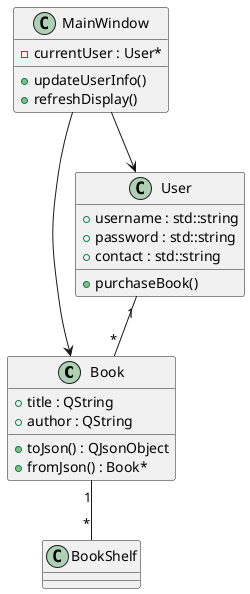

# Roll-Tailed-Stone-Fish-Final
# 翻尾石鱼二手书交易平台

### 一个基于Qt框架开发的校园二手书交易平台，提供书籍买卖、社区交流和用户私信等功能。

# 功能特性

## 核心功能

- 书籍上架与下架管理

- 多条件书籍搜索（标题、作者、标签等）
  
- 用户间实时聊天系统
  
- 社区公告发布与浏览
  
- 用户账户与交易记录管理

## 特色功能

- 智能标签分类系统
  
- 响应式UI设计
  
- JSON数据本地持久化
  
- 自适应布局

  
## 技术栈

- **编程语言: C++11**

- **GUI框架: Qt 5.15**

- **数据持久化: JSON**

- **构建系统: qmake**

- **设计模式:**

  - MVC-like架构

  - 工厂模式对象创建

  - 观察者模式（信号槽）

# 项目结构

```text
FlippingStoneFish/
├── docs/                    # 项目文档
├── include/                 # 头文件
│   ├── Announcement.h       # 公告类
│   ├── Book.h               # 书籍模型
│   ├── BookShelf.h          # 书籍管理
│   ├── Chat.h               # 聊天功能
│   ├── User.h               # 用户模型
│   └── UserManager.h        # 用户管理
├── src/                     # 源文件
│   ├── Announcement.cpp
│   ├── Book.cpp
│   ├── BookShelf.cpp
│   ├── Chat.cpp
│   ├── MainWindow.cpp       # 主界面
│   ├── main.cpp             # 程序入口
│   └── UserManager.cpp
├── ui/                      # UI设计文件
├── resources/               # 资源文件
│   ├── images/              # 图片资源
│   └── styles/              # 样式表
├── data/                    # 数据文件
│   ├── books.json           # 书籍数据
│   ├── users.json           # 用户数据
│   └── chats/               # 聊天记录
├── CMakeLists.txt           # CMake构建配置
└── README.md                # 本文件
```

# 快速开始

## 构建要求

- Qt 5.15+ 开发环境

- C++11兼容编译器

- CMake 3.10+

## 构建步骤

克隆仓库

## 开发环境配置
1.安装Qt Creator

2.导入项目文件夹

3.配置Qt Kit(建议使用Desktop Qt 5.15.x)

4.配置Java环境，需要brew以及maven

5.在Qt项目中搜索需要在本机开启Lucene Search API文档中的服务器SearchApplication

## 开发环境配置
1.安装Qt Creator

2.导入项目文件夹

3.配置Qt Kit（建议使用Desktop Qt 5.15.x）

4.在qt项目中搜索需要在本机开启Lucene Search API文档中的服务器SearchApplication


# 使用指南

## 用户流程
### 1.注册/登录：
- 新用户需提供用户名、密码和联系方式

- 已有用户直接登录

### 2.书籍交易：
- 卖家：通过"放生"页面上架书籍

- 买家：通过"钓书"页面搜索并联系卖家

### 3.社区互动：
- 在"捞书"页面查看和发布公告

- 通过"聊天墙"与交易方沟通

## 数据管理
- 所有数据自动保存在data/目录下

- 程序退出时会自动保存状态

- 手动备份建议复制整个data/文件夹

# 设计文档

## 架构设计

### 采用MVC-like架构分离：

- **模型**：Book, User, Announcement等数据类
- **视图**：MainWindow和各种Dialog界面
- **控制器**：分散在UI类中的事件处理逻辑

### 核心类图




## 最后更新：2025年6月30日

